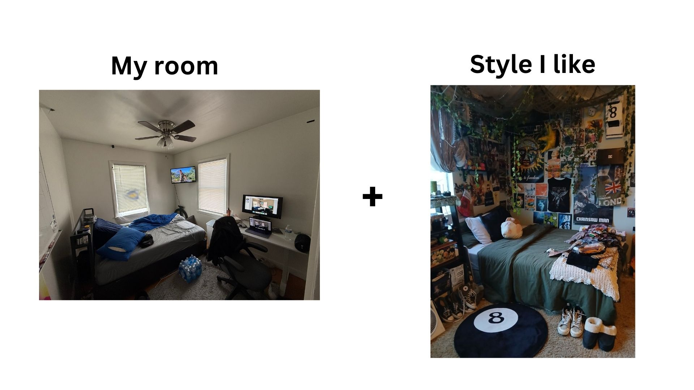
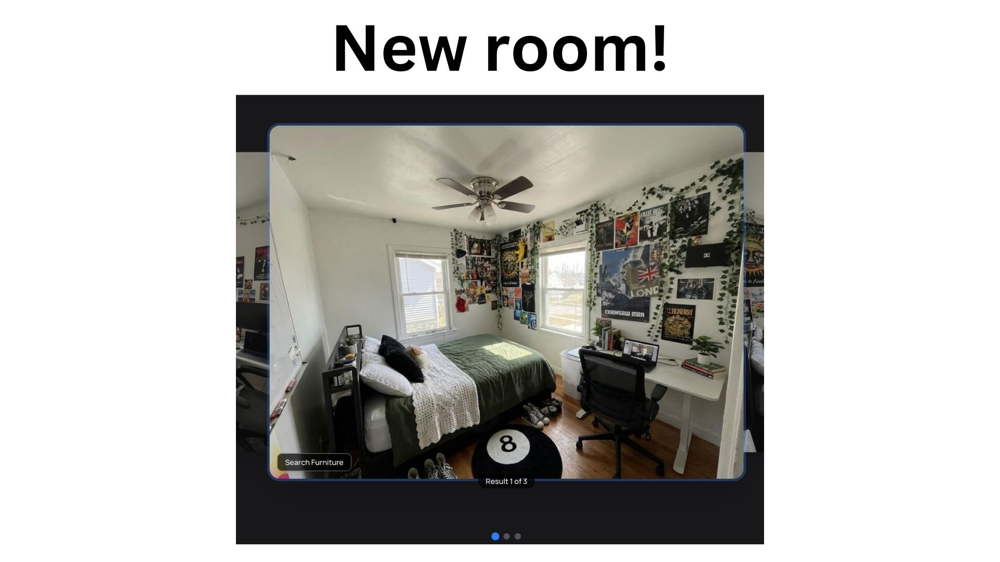
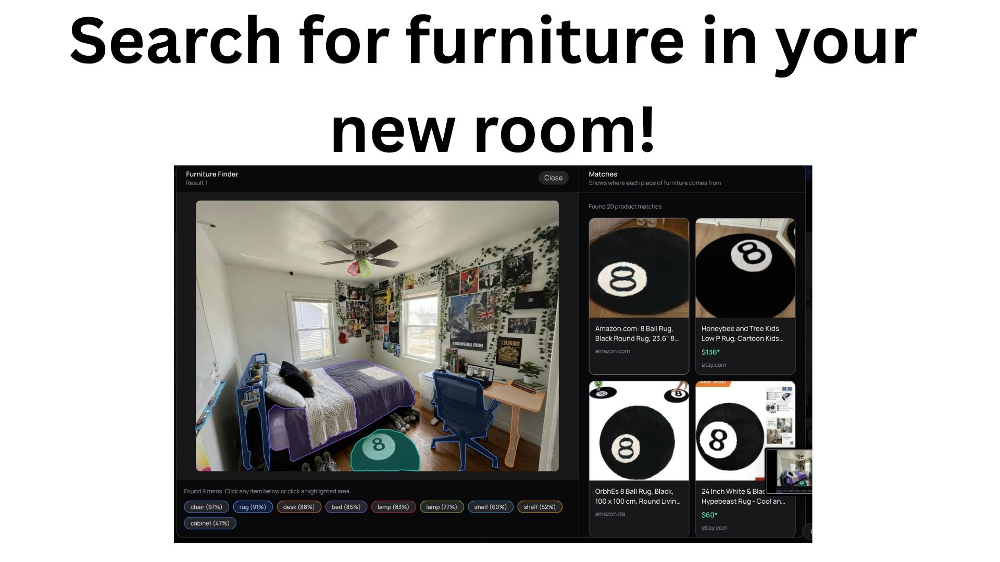
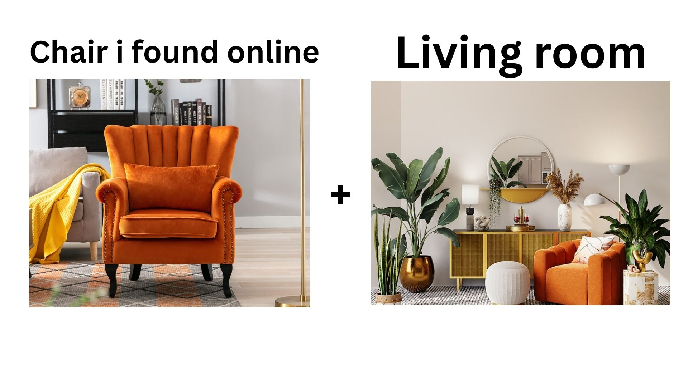
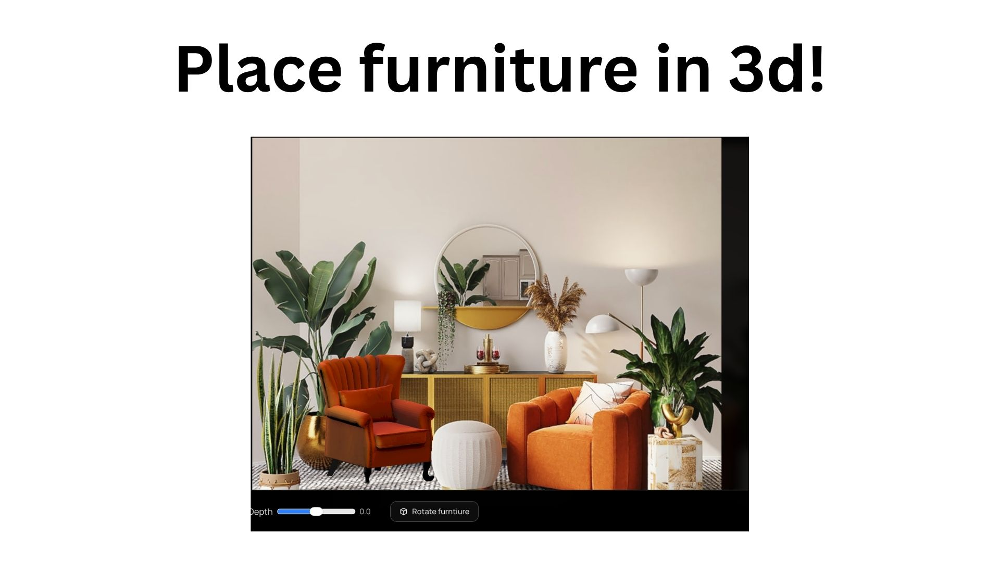
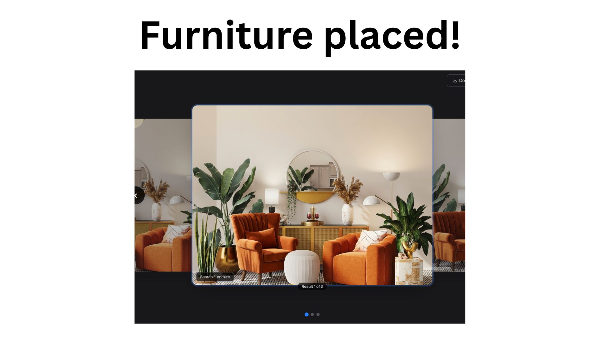

# InteriorAI

Welcome to InteriorAI! A new way to style your room with AI!

This app is made for people who want to quickly see their room in a new, fresh style, without needing to hire an interior designer. [Try It!](https://interiorai-project.vercel.app)

## What It Does

With Add mode, you can visualize what a new piece of furniture that you found online would look like in your room based on just a picture.

With Transform mode, you can visualize what your room would look like with a brand new style using any image you choose.

With Furniture Finder mode, you can quickly identify any piece of furniture you see in a generated picture with just a few clicks.

## Tech Stack

The app uses Next.js, TypeScript, and React for app routing and frontend work.

It uses RunPod GPUs and the fal.ai API to run SAM3 computer vision models.

It uses Three.js for 3D rendering, SerpAPI for image search, and Gemini Nano Banana Pro 2 for image generation.

## Screenshots

